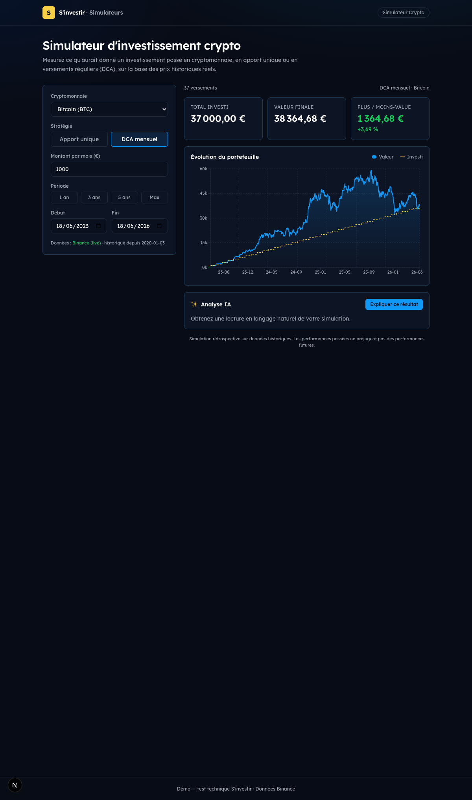

# Simulateur Crypto · S'investir

Transposition du [simulateur crypto S'investir](https://sinvestir.fr/simulateur-crypto-monnaie/)
à l'identité visuelle de la suite [simulateurs.sinvestir.fr](https://simulateurs.sinvestir.fr/).

> Test technique — poste **Développeur IA freelance** chez S'investir.

**Démo en ligne :** https://sinvestir-simulateur-test.vercel.app
**Code :** https://github.com/Equilibretech/sinvestir-simulateur-crypto



## ✨ Fonctionnalités

- **Backtest rétrospectif** d'un investissement crypto (Bitcoin, Ethereum, Solana).
- Deux stratégies : **apport unique** (lump sum) et **DCA mensuel** (versements réguliers).
- Résultats : total investi, valeur finale, **plus/moins-value (€ et %)** + **graphique d'évolution** (valeur vs investi).
- **Analyse IA** : explication du résultat en langage naturel (modèle Claude via OpenRouter).
- Données de prix **hybrides** : Binance en live (historique **multi-années**), **repli automatique** sur un snapshot local si l'API échoue.
- **Présélections de période** (1 an / 3 ans / 5 ans / Max) en plus du choix de dates libre.
- Thème fidèle à `simulateurs.sinvestir.fr`, **responsive** desktop/mobile.

## 🚀 Lancer en local

```bash
pnpm install
cp .env.example .env.local   # puis renseigner OPENROUTER_API_KEY (optionnel)
pnpm dev                     # http://localhost:3000
```

> Sans clé `OPENROUTER_API_KEY`, l'app fonctionne quand même : l'analyse IA bascule
> automatiquement sur une explication générée localement (fallback déterministe).

### Variables d'environnement

| Variable | Rôle | Obligatoire |
|----------|------|:---:|
| `OPENROUTER_API_KEY` | Clé OpenRouter pour l'analyse IA (modèle `anthropic/claude-haiku-4.5`) | Non (fallback sinon) |

## 🧱 Stack & partis pris

**Next.js 16 (App Router) · TypeScript · Tailwind v4 · Lexend · Recharts · Binance API · OpenRouter (Claude) · Vercel.**

- **Next.js plutôt que Nuxt** : le site vitrine `simulateurs.sinvestir.fr` est en Nuxt/Vue,
  mais la **stack interne annoncée** par S'investir est **Next.js + Supabase + Vercel**.
  J'ai donc visé l'infrastructure interne (là où vivront les vraies missions : outils internes,
  agents IA, automatisations) tout en **reproduisant fidèlement le rendu visuel** du site.
- **Tailwind v4** : le site cible est lui-même en Tailwind v4 (tokens OKLCH) → cohérence directe.
  La charte est centralisée en variables CSS (`src/app/globals.css`, cf. [docs/DESIGN-TOKENS.md](./docs/DESIGN-TOKENS.md)).
- **Données hybrides (live + fallback)** : l'API publique **Binance** (paires EUR, sans clé)
  fournit un historique journalier **multi-années** ; un snapshot embarqué
  (`src/data/snapshot.json`) garantit une **démo toujours fonctionnelle**, même hors-ligne
  ou en cas d'indisponibilité de l'API. Les fonctions serveur sont déployées en région
  **Europe (`fra1`)** car l'API Binance bloque les IP US (région Vercel par défaut).
- **Touche IA** : pertinente pour le poste « Dev IA ». L'appel passe par une **route serveur**
  (`/api/explain`) pour ne jamais exposer la clé côté client, avec un **fallback** si pas de clé.
- **Calcul côté client** : le moteur (`simulate.ts`) est une **fonction pure**, recalculée
  instantanément à chaque changement d'input, sans aller-retour serveur.

## 🔌 Intégrabilité

Le simulateur est encapsulé dans un unique composant **`<Simulator />`** (`src/components/Simulator.tsx`),
**sans état global ni dépendance au routing**. Il peut donc :

- **remplacer** le simulateur actuel dans `simulateurs.sinvestir.fr` (drop-in) ;
- être **embarqué en iframe** depuis `sinvestir.fr` (la page `/` sert déjà de point d'embed).

Dépendances volontairement minimales (Recharts pour le graphe ; le reste est natif Next/React).

## 🗂️ Structure

```
src/
├─ app/
│  ├─ page.tsx              # page d'accueil (embed du simulateur)
│  ├─ layout.tsx            # police Lexend + métadonnées
│  ├─ globals.css           # charte S'investir (tokens CSS)
│  └─ api/
│     ├─ prices/route.ts    # prix Binance (live) + fallback snapshot
│     └─ explain/route.ts   # analyse IA (OpenRouter/Claude) + fallback
├─ components/              # Simulator, ResultCards, EvolutionChart, AiExplanation, Header
├─ lib/                     # types, simulate (moteur), prices, coins, format
└─ data/snapshot.json       # snapshot de prix (fallback)
```

## ⚠️ Limites connues (périmètre volontairement court — ~½ journée)

- Historique : depuis **janvier 2020** (BTC/ETH) et **mai 2021** (SOL), profondeur des paires EUR Binance.
- 3 cryptos et 2 fréquences (apport unique / DCA mensuel) — extensible facilement via `src/lib/coins.ts`.
- Frais de transaction non modélisés.

## 📚 Documentation projet

- [docs/BRIEF.md](./docs/BRIEF.md) — analyse des consignes
- [docs/SIMULATEUR-CRYPTO.md](./docs/SIMULATEUR-CRYPTO.md) — logique fonctionnelle de référence
- [docs/DESIGN-TOKENS.md](./docs/DESIGN-TOKENS.md) — charte graphique extraite du site cible
- [docs/PLAN.md](./docs/PLAN.md) — choix techniques & plan
